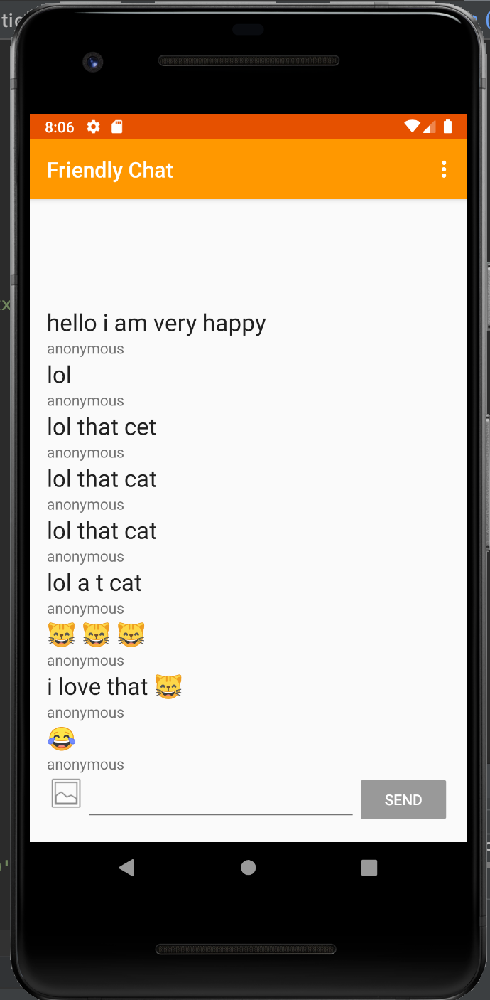

# Simple Chat Andoird App + on the Cloud processing functions -  Using Google Firebase 

FriendlyChat is an app that allows users to send and receive text and photos in realtime across platforms.
Also, it includes a firebase function (on the  cloud)  that changes text to emojis!

## Declaration

This project is based on the the FriendlyChat project in the [Firebase in a Weekend: Android by Google](https://www.udacity.com/course/firebase-in-a-weekend-by-google-android--ud0352) Udacity course.

## License
See [LICENSE](LICENSE)
